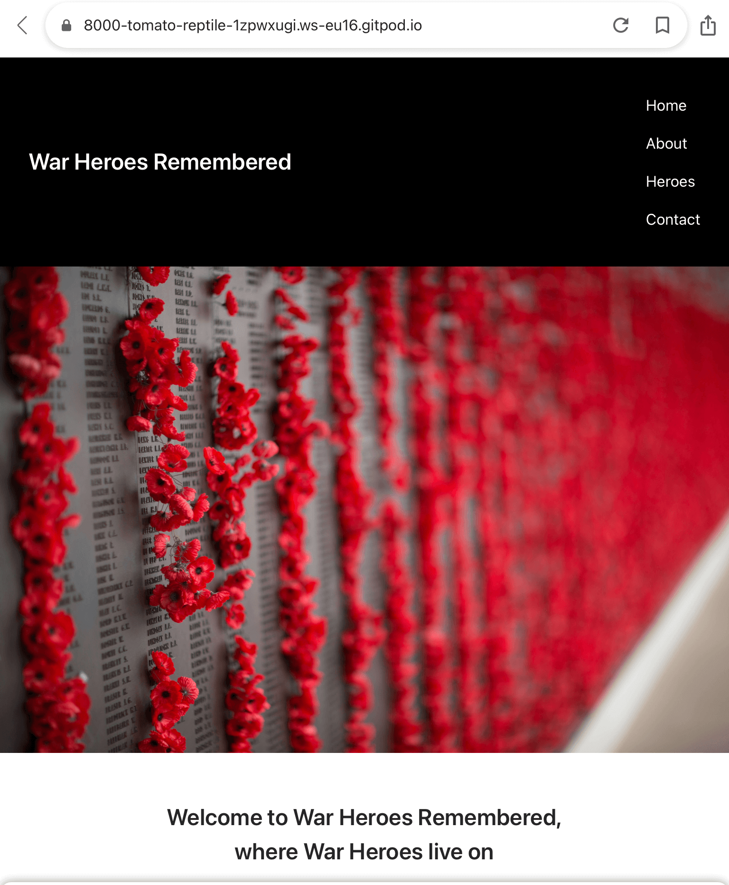
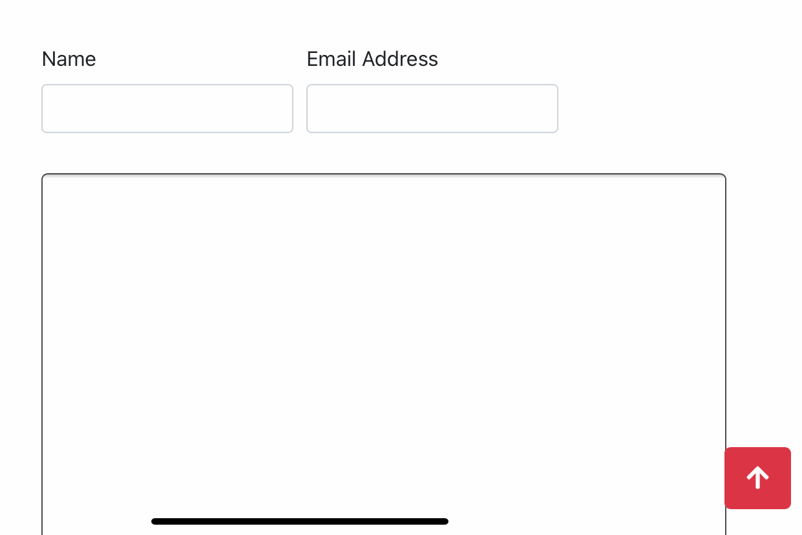

# War Heroes Remembered

This website has been designed to help people learn about some of the sacrifices our heroes of World War One made for us all. I have specifically decided to focus on World War One as this was supposed to be the Great War (although there was nothing great about it), the War to end all Wars, but also because I was able to uncover some of my family’s history with a couple of our relatives that went and played their part, like many other families relatives. I want to use my relatives as a starting point and look at others who played their part and list them, although as there are so many it is unfortunately impossible for me to be able to collate all the images and data alone, hence why I have selected a few Heroes as you will see on my site.

I have also created this site to keep the names and memories alive as well as to show the age ranges that took part and were lost in battle. We owe it to these people who fought for our freedoms not only to keep their names alive, but also remember the cost of war. As is inevitable each year we are losing more and more veterans and the history they have to offer and teach us. I am hoping that by providing a bit of the history as small as it is this as mentioned above helps their sacrifices live on and their memories continue, so we never forget.

## Showcase

A deployed live version of my War Heroes Remembered website can be found [here](https://andrewh1188.github.io/war-heroes-remembered-ms2/)

This domain link will allow you to access my live deployed website for my War Heroes Remembered as part of the Code Institute Full Stack Web Developer Milestone 2 Project assessment.

My website has been designed to be responsive across all platforms. The original design had this in mind as well as to be simple, clean, effective and appealing whilst also with the nature of such a sensitive subject be respectful.

## Table of Contents
1. [User Experience UX](#user-experience-ux)
    * [User Stories](#user-stories) 
    * [As a new / first time user](#new-first-time-user)
    * [Returning Visitor Goals](#returning-visitor-goals)
    * [Frequent User Goals](#frequent-user-goals)
    * [User Customer Goals](#user-goals)
    * [Business Goals](#business-goals)
    * [Scope](#scope) 
    * [Structure](#structure) 
    * [Design](#design)
    * [Imagery](#imagery)
    * [Wireframes](#wireframes)
2. [Features](#features)
    * [Existing-features](#existing-features)
    * [Future-features](#future-features)
3. [Technologies and Languages Used](#technologies)
    * [Other Resources](#other-resources) 
    * [Social Media](#social-media)
4. [Testing](#testing)
    * [Implementation](#implementation)
    * [Results](#results)
    * [Bugs](#bugs)
5. [Deployment](#deployment)
6. [Credits](#credits)
    * [Content](#content)
    * [Media](#media)
    * [Acknowledgments](#acknowledgments)

## User Experience UX 
This website has been designed by myself Andrew Harding because of my interest in military history, as well as in finding out relatives that made the ultimate sacrifice by playing their part in the First World War. I hope that in using this website the users are able to learn about some of the selected heroes that took part as well as potentially trace someone who may be their relative or even someone who crossed paths or was in the same unit as their relative(s).

## User stories 
* I would like the new/first time user to achieve their goals when visiting my website, I would expect my users to be historians and those interested in tracing their own war hero(es) using this site. 
* I would like those using my website to gain an understanding of the history that we have to offer them and hope this sparks their curiosity to want to go on and learn further by being a returning user and expanding their knowledge on a subject that interests them.
* I would like the new user or first time user to understand the reason this page has been created, as well as to learn a bit more about the Heroes listed that took part in World War One.
* As a new user or first time user I would like them to understand that there are many other Heroes that also played their part in World War One (of which I’m sure they will) and that unfortunately it simply wasn’t possible to list all of them as mentioned in the Welcome section on my home / about page.
* I would like my users to take full advantage of the interactive elements that have been specifically placed in order to help them better navigate and use my website. I’m sure if the user is anything like me they will take full advantage of these.
* I would like users to be able to discover the various age ranges of the heroes that took part and have a desire to be able to go on further to learn more.
* I would like to use the memorials and cemeteries locations on the map to be able to paint a picture of those that were in the area at the time and see just how many heroes are remembered/buried in different locations from the country where they were originally born and grew up in.

#### As a first time user I would expect the questions asked would be:
* What does this site have to offer me?
* Is the content relevant to what I am looking for?
* Does this site achieve my aim of what I am looking for?
* Does this site inform me enough to encourage me to want to learn more and do my own research into my relatives?
* Why should I use this website over any of the many other websites?
* Is this something that because of the design, layout, interaction and cleanliness of the site I will be returning to?
* Is the information that I am viewing/reading accurate?
* Is the information as up to date as it can possibly be?
* Is the information enough, too little or too much?

#### Returning Visitor Goals 
* As a returning user/visitor I would like to see updated content with more Heroes added.
* I would like the same level of clarity, information and clean layout as there is currently.
* With more Heroes added I would like to see more locations added to the map so that I can visit these.
* I would like to see more information regarding locations of where the heroes are remembered/buried added to this site.
* I would like to be able to trace and find any other heroes that may have been in the same unit(s), location or fought alongside with at the same time as my relative. 

#### As a returning user I would expect the questions asked would be:
* Is the information helpful to me and what I am looking to achieve and how I would like to achieve this?
* Have the Heroes section been added too?
* Has the website been updated and refreshed with new content, information or pages?
* Has the map been updated with the new locations?
* Has a section been added for information on the locations?
* Is the information that is currently there and the new information still of interest to me?
* Am I able to achieve my goals and needs?
* Am I able to learn more about the events before, during and after the War regarding the Heroes that were fortunate to return?

#### Frequent User Goals
* Again as mentioned in the returning user goals, I would like to see more content with more heroes added.
* I would like to see more locations that relate to the heroes that have been added.
* I would like to be able to get involved with this website and contribute towards it to help build it.

#### As a frequent user I would expect the questions asked would be:
* Is there a way in which I can contribute towards this site in the way of adding more heroes?
* If there is a way that I can get involved and contribute how can I do this?
* Is the site being maintained, looked after, updated and constantly improved so that users like me are able to keep using this website and the interactive features?

#### User Goals
The user goals that I would like War Heroes Remembered to provide to the user are:
* To be able to find out the necessary information quickly, reliably and easily. This is what will keep users focused, and also returning for more.
* There is the ability to find out about the heroes listed as well as the location of the memorials/cemeteries in which the heroes are remembered or are buried on the contact page at the top. 
* With the map showcasing the memorial/cemeteries the user is able to see where the heroes are buried/remembered from anywhere in the world. In doing so this allows them to plan a visit or holiday.
* With the added social media, this increases the user interaction and allows them to be able to continue their journey as well as upload other heroes and text for future updates to my website.
* There is the ability other than social media for users to also make contact/interact with us by filling in their name, email and their enquiry or message.

#### Site Goals 
The site goals that I want to achieve from creating this website are:
* I would like to be able to reach out to people that may be interested in finding out about the past in relation to World War One but with a focus in a sense less on the bigger picture but more on the people that played their part. In doing so this makes the site more personal and I feel a connection with my website and the content as a visitor/user.
* In having the ability to find heroes that are buried at the cemeteries or remembered on memorials listed on the map. In doing so I would like and hope that users will visit these locations to pay their respects to those that went out and made the ultimate sacrifice.
* I would like visitors/users to engage with the interactive features as well as make the most of the social media pages and accounts that I have set up for this project.
* I would like visitors/users to be able to take something from my site and the aims of my site which is about learning all about the different heroes that have been listed.

#### Strategy
When planning the site I was originally going to call this A Heroes Story, Heroes Stories, Stories of Heroes but decided that although these names contribute to the site content and what it was to be about that I had in mind, telling the stories of heroes would not be a strong enough title and telling the stories of heroes would not be as easy as I first thought as there are so many that there is very little known about them. Also with this in mind I had to refine the site and as they say keep it simple. This lead me to come up with the name War Heroes Remembered. With this name in place I was able to set the grounds for what I wanted the project to be about, what I required, the design and layout that I wanted to produce and see as the final finished website.

#### Scope
With the layout of my website designed as I have done, I wanted to achieve the easy effective clean look and feel, whilst also making the HTML and CSS quick to go through, this is so that I would be able to get stuck in with the JavaScript sections that I added to incorporate the interactivity of the visitor/user of my website.

Having the simple effective deign and layout I want my users to be able to obtain and learn the information as quickly as possible, without having to go searching all over my website.

#### Structure
I have structured the information/content on the relevant pages to allow the user/visitor obtain this easily and efficiently. This allows my website to be fully functional in terms of user-friendly and reliability that the user will be able to obtain the relevant information according to page title and content on this page.

#### Skeleton
Like the Structure plane all information will be grouped on the relevant pages under the relevant links and titles on the page. The information will be represented with icons for the social media platforms (that feature across all pages) as well as text and appropriate images for the content/text this is referring to or relating to. There will be images included that relate to the theme of the site of remembrance like poppies, crosses, graves and memorials. The user will be able to use the links in the nav bar to get from one page to another efficiently and effectively.

#### Surface
The finished product will look respectable and clean. This is so that the users/visitors can see and get the feel of the site and its aims, whilst also remembering the users will be able to learn and interact. I have chosen a font from [Google Fonts:](https://fonts.google.com/) called [Poppins](https://fonts.google.com/specimen/Poppins?query=popp) that I think is clean and complements the feel of the site that I am after showcasing to the users/viewers of my site. Dark colours such as black and red have been added to keep in with the element of remembering and also complement each other as well as a light stone colour to offset the both of these. The colours of the light stone and dark red have been taken from the images and helps tie everything neatly together aiding the clean design, look and feel of my finished website.

## Design
This site has been designed over four pages and has links in the nav bar for four pages which are Home, About, Heroes and Contact Us. There is an extra Heroes page which isn’t featured in the nav bar links, this is because I wanted to add a toggler to the bottom of the Heroes page, this is so that when the user reaches the bottom of the Heroes page 1 they are able to continue their journey and read about Heroes featured on page2. I hope that by doing this I can increase the user interaction of my page as well as inform the user a bit more about the extra Heroes that I have researched.

Incorporated int the Home page is the About section down near the bottom in order to add extra content to the Home page, this and to give the user a feel for the page and why they should continue with it and what they can expect. 

The Heroes page as mentioned above features a second page of Heroes that is accessed from the first page. This is to add interaction and get the user engaging with the page a bit more, but also to enable them to keep discovering and learning along their journey throughout the page.

The Contact Us page features the map at the top of the page and this allows the user to search for the heroes listed on the page grave sites or where they are remembered / commemorated on a memorial. By adding this it also allows for more interaction from the user as well as allowing them to potentially visit the site / location of the Hero listed. Also on the Contact Us page the user has the ability to message / contact at the bottom of the page. This has been linked to [EmailJS](https://www.emailjs.com/) which is linked to my email account that I have specifically set up to allow me to receive emails / messages that the user has sent. 

Throughout the site using [Material Design for Bootstrap MDB](https://mdbootstrap.com/) there is the ability on whatever device the user is viewing my website on to be able to go back to the top of the page with a button that appears when they scroll down. As mentioned this has been done using [Material Design for Bootstrap MDB](https://mdbootstrap.com/docs/standard/extended/back-to-top/).

The designs original and amended can be found using the links below:
* [Original Home Page](/workspace/war-heroes-remembered-ms2/assets/images/designs/whr-home-page.jpg)
* [Original Heroes Option 1]/workspace/war-heroes-remembered-ms2/assets/images/designs/whr-heroes1-page-option1.jpg)
* [Original Heroes Option 2](/workspace/war-heroes-remembered-ms2/assets/images/designs/whr-heroes2-page-option2.jpg)
* [Original Contact Page](/workspace/war-heroes-remembered-ms2/assets/images/designs/whr-contact-page.jpg)
* [NEW Heroes Page 1](/workspace/war-heroes-remembered-ms2/assets/images/designs/whr-heroes-1-page-new.jpg)
* [NEW Heroes Page 2](/workspace/war-heroes-remembered-ms2/assets/images/designs/whr-heroes-2-page-new.jpg)
* [NEW Contact Page](/workspace/war-heroes-remembered-ms2/assets/images/designs/whr-contact-us-page-new.jpg)
* [Instruction Page](/workspace/war-heroes-remembered-ms2/assets/images/designs/whr-instruction-page.jpg)

The font that has been used throughout my site is called Poppins as this is a nice clean font and I think complements the nature of the design and what the site is about. I have used the same font throughout my site in order to keep consistency, a clean look and tie all the pages in the way of design and feel together.

I have chosen the following colours:
* #d31216 - red - which has been used for hovered links.
* #fff - white - links and text in the black nav and footer bars.
* #ceb7a5 - a stone like colour - which has been used to show active links.
* black - which has been used for the nav bar and footer.

All colours have been used as they complement the look and feel of the page as well as each other. I selected the red and the stone colour from the images using the Adobe InDesign colour picker. I used Adobe InDesign in order to make a mock up of my final web page. In doing this it allows me to see a bit better than the wire frames how the final outcome will closely match my [Adobe InDesign](https://www.adobe.com/uk/products/indesign.html) final file. Also this gives the user / another developer the ability to see the static designed version and compare this to my live version.

In my original design I added a basic [Instruction Page](/workspace/war-heroes-remembered-ms2/assets/images/designs/whr-instruction-page.jpg) which has allowed me to refer to this for the colours that were used so that I can not only add them above in my README.md file, but also onto the site itself. In this file there are the icons and the links from [Font Awesome](https://fontawesome.com/) which has helped and sped up the construction of my website.

## Imagery
* I designed the Favicon in [Adobe Illustrator](https://www.adobe.com/uk/products/illustrator.html) then exported this as a jpg in order to add this into the images folder without any issues. I created the Favicon as a larger size than the usual that is required as this makes the resolution when displayed in the browser view higher resolution than the normal favicon size which appears pixilated. 
* The great image used as the Hero image on the home page had to change from the one on my initial design because I couldn’t find where I originally downloaded this from, so couldn’t credit the person that took this photograph. I found the new and very similar image on [Adobe Stock](https://stock.adobe.com/uk/) that I am able to credit.
1. [Poppies on the remembrance wall](https://stock.adobe.com/images/poppies-on-the-remembrance-wall/231816455?asset_id=231816455)
 * file #: 231816455
 * Photo uploaded to Adobe Stock by Vince
I selected this as the Hero image for the Home page (index.html) as it is a strong, complementary, respectful image to use as the remembrance wall has many poppies in to the fallen heroes. This image is complemented by the choice of colours that I have used.
2. [Graveyard with monument in Normandy](https://pixy.org/search.php?search=Graveyard+with+monument+in+Normandy)
This is the image that I have used on the home page (index.html) above the About Us (index.htm#aboutl) section. I have used this image to section off the about us section and also as it is in keeping with the theme of the site and what this is about which is remembering as well as learning about our War Heroes. 
3. [Colleville-Sur-Mer Cemetery D-Day United States](https://pixabay.com/photos/colleville-sur-mer-cemetery-d-day-2139248/) 
 * Photo uploaded to Pixabay by herb1979
This image has been downloaded from [Pixabay](https://pixabay.com/) and used on the Heroes page.
[memorial, cemetery, military, d-day, normandy, graveyard, monument, peace, memory, landmark, patriotic](https://www.pikist.com/free-photo-vsecq)
4. [Ramscappelle Road Military Cemetery](https://stock.adobe.com/uk/images/ramscappelle-road-military-cemetery/179912388)
 * file #: 179912388
 * Photo uploaded to Adobe Stock by Kartouchken
This image has been used for the Heroes that unfortunately have no photo of them available. This image has also been used on Facebook, Twitter and Instagram for the Heroes as well.

#### Heroes Page 1 image sources
5. [Private Richard Spearink](https://stock.adobe.com/uk/images/ramscappelle-road-military-cemetery/179912388)
 * file #: 179912388
 * Photo uploaded to Adobe Stock by Kartouchken
6. [Private Frederick Spearink](https://www.ww1cemeteries.com/uploads/7/4/4/5/74452945/helles-mem-spearink_orig.png)
7. [Thomas Banister](https://livesofthefirstworldwar.iwm.org.uk/lifestory/167008) Source information ID: 9322132
8. [Second Lieutenant Sidney Vandyke Hasluck](https://www.iwm.org.uk/collections/item/object/205300873) Imperial War Museums credit © IWM HU 123053.
9. [Nurse Elizabeth McMath (Daisy) Warnock](https://www.iwm.org.uk/collections/item/object/205381399) Imperial War Museums credit: © IWM WWC D13-H2-74.
10. Private Thomas Phillips - My own photo taken on my iPhone 11 at the Huthwaite Cemetery Cenotaph Memorial.
11.[Leading Seaman John Sexton](https://stock.adobe.com/uk/images/ramscappelle-road-military-cemetery/179912388)
12. [Lance Corporal Arthur Norman (Barney) Allen](https://www.awm.gov.au/collection/P10687374) Item copyright: Copyright expired - public domain, Public Domain Mark This item is in the Public Domain.

#### Heroes Page 2 image sources
13. [Major and acting Lieutenant-Colonel Harry Moorhouse](https://archives.passchendaele.be/en/soldier/1284) 
14. [Captain Ronald Moorhouse](https://archives.passchendaele.be/en/soldier/1286)
15. [Private John “Jack” Henry Thomas](https://www.canada.ca/en/department-national-defence/services/military-history/history-heritage/casualty-identification-military/private-john-henry-thomas.html)
16.  [Private Bertram Alec Reader](https://ww1richmond.wordpress.com/2016/05/20/boy-soldier-private-alec-reader/)
17. [Trooper George Ernest Dawkes](https://stock.adobe.com/uk/images/ramscappelle-road-military-cemetery/179912388) 
18. [Private Adolphus Jack](https://stock.adobe.com/uk/images/ramscappelle-road-military-cemetery/179912388) 
19. [Lance Corporal Norman Frank Ewart Cole](https://livesofthefirstworldwar.iwm.org.uk/lifestory/886777) 
20. [Rifleman Henry William Longman](https://livesofthefirstworldwar.iwm.org.uk/lifestory/5418305) 
21. [Remembrance Day](https://www.publicdomainpictures.net/en/view-image.php?image=12797&picture=remembrance-day)
 * Photo uploaded to PublicDomainPictures.net by Petr Kratochvil
[PublicDomainPictures.net](https://www.publicdomainpictures.net/en/)
This image has been used on the Contact Us page at the top.
22. [Poppies Field Sunset Dusk Sunlight Flowers Meadow](https://pixabay.com/photos/poppies-field-sunset-dusk-sunlight-174276/)
 * Photo uploaded to PublicDomainPictures.net by danigeza
[PublicDomainPictures.net](https://www.publicdomainpictures.net/en/)
This photo has been used on the Contact Us page in the middle and used on Facebook, Twitter and Instagram also as the main image.
23. [Facebook icon](https://fontawesome.com/v5.15/icons/facebook-f?style=brands)
24. [Twitter icon](https://fontawesome.com/v5.15/icons/twitter?style=brands)
25. [Instagram icon](https://fontawesome.com/v5.15/icons/instagram?style=brands)
26. [YouTube icon](https://fontawesome.com/v5.15/icons/youtube?style=brands)
27. [Send icon](https://fontawesome.com/v5.15/icons/paper-plane?style=regular)
28. [Back to top](https://fontawesome.com/v5.15/icons/arrow-up?style=solid)

## Wireframes
The wireframes that I have produced for War Heroes Remembered can be located [here](/workspace/war-heroes-remembered-ms2/assets/images/designs/wireframes). I wanted to keep the various pages to be simple, clean and relay the information clearly as a user would expect.
I have created very basic wireframes using [Balsamiq](https://balsamiq.com/) and have as you have read above produced a more finalised version in [Adobe InDesign](https://www.adobe.com/uk/products/indesign.html). Using the Balsamiq app allowed me to do the rough layout before a more finalised version was produced in Adobe InDesign and then coded into GitPod.
With keeping the layout clean and simple it will also allow me to focus on the JavaScript functions for the various pages. 
* Home / index (which encompasses the about section) wireframes can be found [here](/workspace/war-heroes-remembered-ms2/assets/images/designs/wireframes/whr-wireframes-home.png)
* Heroes original wireframes can be found [here](/workspace/war-heroes-remembered-ms2/assets/images/designs/wireframes/whr-wireframes-heroes-original.png)
* Contact Us (which encompasses the maps section to find your hero) wireframes can be found [here](/workspace/war-heroes-remembered-ms2/assets/images/designs/wireframes/whr-wireframes-contact.png)
### Changes to wireframes
Since the original wireframe designs were completed and after my first Mentoring Session, I decided to add a bit more JavaScript by adding a toggler to the bottom of the Heroes page so that this goes onto a second page with the same layout, but different Heroes. This is just to add a bit more interactivity to this page. 
* The changed Heroes wireframes can be found [here](/workspace/war-heroes-remembered-ms2/assets/images/designs/wireframes/whr-heroes1-wireframes.png) and [here](/workspace/war-heroes-remembered-ms2/assets/images/designs/wireframes/whr-heroes2-wireframes.png).
All other wireframes have remained the same and this has allowed me to be able to advance with the site to the building and testing stages, as well as to document my results in this very README file.

## Features
In this section I will briefly highlight some of the features that my website contains, why I have added these as well as the future developments, improvements or additional information or images that I would like to do in order to keep content relevant, attract new users / visitors and keep existing users / visitors returning. I believe in doing this I will be able to take this website and make it a site users are happy to return to and want to return to.
* All pages are similar in layout and are visually appealing and clean to view and enables the user to find the content that the user is looking at or looking for.
* Like my Go Tennis System Milestone 1 Project I have again incorporated the About Us into the home page at the bottom. This is to give the user a clear idea of what it is I am trying to achieve with my website, and why they should continue further with their journey on my page. The about section can easily be accessed in my nav bar as there is a link that takes you down to this section.
* In the nav bar I’ve enabled the War Heroes Remembered name to be clicked on as a link to easily take the user/visitor back to the home page of my website making this user-friendly.
* The nav bar allows you to quickly jump to the selected page that has been clicked by the user/visitor. This also shows the active link as well as allowing the user to see this is a link as when hovered over the link goes a different colour. This is again to give the user/visitor a better user experience.
* The nav bar collapses to the hamburger or as font awesome call it bars icon. This allows the users to be able to navigate on any small sized device like a phone or tablet they are using.
* The back to the top has been added in to enable the user to have a better user experience on all pages, this is particularly handy when it comes to smaller devices, but should also be made use of on larger screens like I do when I test and view my website.
* The maps section allows users to see where the locations of the heroes are as remembered or buried.
* The contact form is there for users to interact and get in touch. This has been specifically linked to my Gmail address that I created for this project and enable the users’ messages to receive a more personal reply rather than coming from a no reply email or one that may potentially auto spam itself in the users junk folder.
* This website is responsive across all viewports and is able to work on all devices, although there maybe some devices that have restrictions where JavaScript comes into play, although I shouldn’t have thought that would be the case in this day and age.
* Elements are interactive to engage the users to visit and interact with these.
* Included for the users of my website is another way of interacting and staying informed via the icons at the bottom in the footer, these take you directly to my social media platforms and allow the users to also get in contact, stay informed as well as provide some more interaction. Users interacting with my social media platforms are also able to upload photos and add text of other Heroes they would like to see on both my website and social media and are therefore contributing to the success or making sure we remember as many War Heroes as possible. By contributing to the social media platforms this allows a speedy way of being able to get more information and data quickly to enable more uploads to my website, but this also helps give the user a sense of contributing and being part of my website / community / family. This enables the user to participate and have their actions appreciated and acknowledged.

### Existing features
* The user / visitor is able to fill in their name and email on the contact form. The details that the user submits are sent to my [Google Gmail](https://www.google.com/gmail/) email address and this will allow me to be able to respond to their messages or enquiries.
* With the design and layout most items are able to fit nicely when viewed on smaller screen devices. This has been achieved because of the way the site has been designed and with some elements using Media Queries to assist.
* All links have the dark red hover colour to show users these are active working links.
* The Facebook, Twitter and Instagram icons all link to the accounts/pages that I have specifically set up on the different social media platforms to that link to War Heroes Remembered. The only exception is the YouTube icon which links to the main YouTube page, as there isn’t an account/page set up on here for War Heroes Remembered.
* Having the social media there that links to my Facebook, Twitter and Instagram pages/accounts allows the user to also interact with us here, uploading and contributing their heroes and information about them.
* My website has incorporated favicon of a poppy on a black background which displays in the viewers browser tab, this has been added to give it a more professional look and help with the finished feel of my overall site.
* The visitor/user is able to see on the map where the listed heroes are buried/remembered and this enables them to be able to visit these locations if they would like to or are able to.
* A back to the top has been added in order to further assist and help the user, especially when they are using a smaller screen device.

### Future features
* I would like to add a way in which the user can submit photos and text in order to help add more War Heroes to this site and make the lists of those that fought grow. This would not only allow everyone to hopefully be included and remembered, but inclusive of all countries that helped fight for freedom and all heroes that helped secure this.
* I would like to be able to add more heroes onto this site and expand it further. To achieve this I would need to research more about other heroes and load these into my website in the same style and layout as is currently displaying.
* With the new additions I would like to add new categories, in order not only to separate the heroes into years that they were killed, but the countries they were from in order to keep everything neat, tidy and easy to find for the user.
* To help the user potentially find a relative of theirs as the site grows I would like to add a search bar at the top so the user can search the site easily, without the need to have to search each page manually.
* Where the need for more than one page occurs have the heroes span over multiple pages.
* On the pages where records go over more than 1 page when the user clicks the number at the bottom have the page automatically scroll to the top of the new page that they have clicked on.
* I would like to not only focus on the unfortunate people that didn’t return but also those that did as they are all heroes as well.
* I would like to branch from World War One into World War Two but would need to separate this in the menu bar with a new link, then from there like the additions to the World War One section categorise this into the relevant sections, based on where they fought, and if they were the fortunate ones to live to tell the tale of the horrors they unfortunately witnessed.
* Branching out and mentioning sections I would like to have for example Battle of Tannenberg, Battle Of Cambrai (1917), German Spring Offensives On The Western Front (1918), Battle Of The Somme (1916) which are some of the key dates/campaigns in World War One, to Operation Torch (November 1942), Siege Of Leningrad (September 1941 To January 1942), Battle Of The Atlantic (September 1939 To May 1945), Battle Of Britain (July 1940 To October 1940), Operation Barbarossa (June To December 1941) some of the key battles/campaigns of World War Two. With these sections/categories, I could put the Heroes and History in which would help people that know about their relatives and the campaigns/dates to help the user better find their Heroes easily.
* I would like to add a section with all the FAQ or Frequently Asked Questions, this is in order to again facilitate the user and give them a better experience whilst saving them time filling out the contact box and waiting for a reply to their question.
* I would like to add the ability to trace and find other heroes that were in the same unit(s), location or fought alongside with my relatives as well as the other heroes. I would like to see if they have stories or more to tell about the conditions, life, moral, etc.
* If I am able to find any photos of those that sadly I was unable to find I would like to be able to add these in to make sure that all heroes have a face to their name.

## Technologies and Languages Used:
I have been able to build this fully functioning website using the below languages, technologies, libraries, tools, programs other resources as well as have the help from Social Media as listed.

## Languages:
* [HTML5](https://en.wikipedia.org/wiki/HTML5)
* [CSS3](https://en.wikipedia.org/wiki/Cascading_Style_Sheets)
* [JavaScript](https://en.wikipedia.org/wiki/JavaScript)
* [jQuery](https://jquery.com/) 

## Libraries Frameworks and online resources:
* [Bootstrap 4.6.0:](https://getbootstrap.com/docs/4.6/getting-started/introduction/)
 Bootstrap was used to help set the navigation bar.
* Google Chrome Dev Tools: For testing purposes and to see why elements are not working as expected. Dev tools allowed me to make changes to my code in the browser to see a live representation of the website with the changes / amends that have been made.
* [Lighthouse](https://developers.google.com/web/tools/lighthouse): Was used for testing website performance, check for Performance, Accessibility, Best Practices and Search Engine Optimization (SEO). I have tested as before on my Go Tennis System the different categories mentioned above on both mobile applications and computer applications and have loaded the screenshots of the results in the testing section.
* [Google Fonts:](https://fonts.google.com/) Google Fonts was used to find a suitable font as well as to import this font into my website. The font that I decided to use as it was clean, stylish and fitting is called Poppins which is displayed on all pages on my website / throughout the project. This is to keep styles consistent throughout my website. 
* [Font Awesome:](https://fontawesome.com/) I have used fewer icons this time as I didn’t think that too many were appropriate given the subject of the site. The Font Awesome Icons that I have used have been listed below:
    * [Hamburger Bars icon](https://fontawesome.com/v5.15/icons/bars?style=solid)
    * [Facebook icon](https://fontawesome.com/v5.15/icons/facebook-f?style=brands)
    * [Twitter icon](https://fontawesome.com/v5.15/icons/twitter?style=brands)
    * [Instagram icon](https://fontawesome.com/v5.15/icons/instagram?style=brands)
    * [YouTube icon](https://fontawesome.com/v5.15/icons/youtube?style=brands)
    * [Arrow Up icon](https://fontawesome.com/v5.15/icons/arrow-up?style=solid)
    * [Send icon](https://fontawesome.com/v5.15/icons/paper-plane?style=regular)
* [W3C HTML-validator:](https://validator.w3.org/) used to find errors in my HTML code as well as implement the suggestions to fix these.
* [Jigsaw:](https://jigsaw.w3.org/css-validator/) used to find errors in my CSS code as well as implement the suggestions to fix these.
* [JS Hint](https://jshint.com/) for my JavaScript to see if there are any errors and use the feedback to fix these.
* [Tiny PNG](https://tinypng.com/) Again my friend Tiny PNG was used to compress the file size of all images without losing any of the original image quality or distorting the images in any way. This is so that when the pages are loaded the images do not slow down the loading speed and therefore make this user-friendly, as well as reduces the bounce rate of users viewing and clicking off the pages.
* [Google Maps API](https://developers.google.com/maps) I used the Google Maps API in order to add a map to my contact page with the markers and clusters in the areas that required these.
* [EmailJS](https://www.emailjs.com/) I used EmailJS in order to hook up my contact section to my email in order to receive feedback, questions or submissions from the viewers that have interacted with my site.
* [Material Design for Bootstrap MDB](https://mdbootstrap.com/) was used for [scroll back to top](https://mdbootstrap.com/docs/standard/extended/back-to-top/) to enable the user to effortlessly scroll back up to the top of the page without having to do this the long way.

## Tools:
* [GitPod](https://www.gitpod.io/) was used to write my code as well as paste in code from Bootstrap. In GitPod I was also able to amend the code from Bootstrap as well as create and style code in both HTML and CSS. I was able to add images to the folders that I created, as well as files to contain the code. In GitPod I was also able to (using python3 -m http.server) view my web page in the browser in a separate tab, allowing me to use the inspect section in Google to inspect elements and see what worked, as well as what didn’t work and amend this accordingly.
* [Git](https://git-scm.com/) Git was used for version control having set up the GitPod Terminal to commit and push saved changes and commits to GitHub.
* [GitHub:](https://github.com/) GitHub was used to store the saved changes from my project after being pushed from Git.
* [GitHub Pages](https://pages.github.com/)was used to deploy my website and make this live for all to explore and use.
* [Balsamiq:](https://balsamiq.com/) was used to create the initial [wireframes](assets/images/designs/wireframes) and amend them to reflect the new feature(s).

## Programmes:
* [Adobe InDesign](https://www.adobe.com/uk/products/indesign.html) Adobe InDesign was used to create the design mock up of the site using colours, images, setting the text and layout. I used Adobe InDesign to do this so that I had something that I could use as a final and a visual as to how the final would look. I exported the final design as an Adobe Acrobat PDF and as a jpg. I have used the jpg format as there was an error/problem with the PDF showing/displaying in GitPod when I loaded this and the Wireframes that were created in Balsamiq and also exported to Adobe Acrobat PDF
* [Adobe Illustrator](https://www.adobe.com/uk/products/illustrator.html) Adobe Illustrator was used to create the poppy favicon and export this to a jpg so that this could be loaded into GitPod and display in the tab next to the War Heroes Remembered document name.
* [Adobe Photoshop](https://www.adobe.com/uk/products/photoshop.html) Adobe Photoshop was used to scale the Hero images as well as the photos of the Heroes, or ones that were used if the Heroes didn’t have a photo of the Hero.

## Other Resources:
* [W3 Validator](https://validator.w3.org/) to check for any HTML errors and use the feedback to resolve / fix these. 
* [W3 Css Validator(https://jigsaw.w3.org/css-validator/) to check for any CSS errors and use the feedback to resolve /fix these. 
* [Code Institute](https://codeinstitute.net/) and the learning that I have completed so far with them. This has enabled me to put together and complete my project.
* [Code Institute](https://codeinstitute.net/) I have re visited video tutorials that the Code Institute have provided regarding the different JavaScript sections. The main video tutorials were with Rosie’s Resume and adding the JavaScript elements with regard to the map and EmailJS to help me through the setup and getting mine fully functional.
* [Stack Overflow](https://stackoverflow.com/) I have used Stack Overflow in order to search for answers to my questions like why I keep getting an error with the JavaScript regarding the initMap in the console. I have looked to see if there are any suggestions on how to resolve this and other JavaScript areas that may be experiencing errors.
* [Stack Overflow - jQuery](https://stackoverflow.com/questions/39128483/show-more-show-less-with-jquery) Was used to show more/show less button change state answered by [Alex Char](https://stackoverflow.com/users/3420271/alex-char). This has been referenced in the heroes js file also.
* [demo2s](https://www.demo2s.com/javascript/jquery-toggle-show-hide-method.html) Was used for the show/hide toggle for the heroes to make them appear and disappear. This has been referenced in the heroes js file also.
* [Ahmad Awais](https://codepen.io/ahmadawais/pen/NQdWQx?editors=1010) I used this to look and see how they managed to lay out the markers with the location names. I used their style for the var locations and did the same for mine. When the Marker is clicked the Hero location and name will show.  
* [Am I Responsive](http://ami.responsivedesign.is/) was used for the screenshot of the mock up which is at the top in my README.md file and also to show off my site my different social media platforms. 
* [Google Chrome Developer Tools](https://developer.chrome.com/docs/devtools/) was used to test sizes, check responsiveness and view the layouts as well as debug errors and problems I encountered along the way.
* [Prettier.io](https://prettier.io/) was used to make my CSS look neat, tidy and easier to follow / read.
* [Grammarly](https://www.grammarly.com/) was used for checking the spelling and grammar for the content of my website.
* [Onlinespellcheck.com](https://www.online-spellcheck.com/) I have run my README.md through here to check for any spelling or grammar errors.

### Social Media:
I set up a group on [Facebook](https://en-gb.facebook.com/) called [War Heroes Remembered](https://www.facebook.com/groups/911836479678983/) so that the Facebook icon in the footer had somewhere to link too. I also set up a [Twitter](https://twitter.com/) page [@war_remembered](https://twitter.com/WarRememembered) as well as an [Instagram](https://www.instagram.com/) page [war_heroes_remembered](https://www.instagram.com/war_heroes_remembered/) so that these icons had somewhere to link too. I wouldn’t have thought nor believed that where would be many people following or liking the content that is currently on my Instagram page, but as there are people every day following and liking my content and page I have decided that I will continue to work on this after my Milestone Project submission and after I have finished the course adding content as I am grateful for the support that I have been receiving on a daily basis. With the icon for YouTube I have left this linking to the home page of [YouTube](https://www.youtube.com/) as I haven’t set up an account and don’t have any videos, although there is nothing stopping me from doing this in future as part of this project going forwards in the future. 

## Testing:
As this is a site that I have created for myself as an interest in military history and have also uncovered some of my relatives that played their part in World War One. Taking into consideration users would be viewing my website on different screen sizes I factored this into the original design, although this didn’t stop issues with the code in places, like the map and the message area that was viewing at a width greater than the phone screen size, but these were quickly addressed using the media queries in CSS. As part of an effort to help myself and mentioning CSS and media queries I put in the different screens that would be likely to fit into the different media query types as comments above the sizes. This not only benefits me now but also when I come to use these little works of magic further on in the course or in my career as they are there as a reference and guidance. When it came to implementing the technologies I used Bootstrap to help with some areas like the nav bar. This helped speed up the production slightly, although when there are areas of the nav bar that could be improved upon. When testing this the links were too close to the page “brand”, the toggle icon disappeared as the black nav bar hid this, but with the help from Dev Tools and identifying the area to target I was able to show the toggle icon, although unfortunately not address the positioning of the links. Speaking of using Dev Tools this allowed me to view my site and its appearance on other devices as wells to show other screen sizes and see the break points in responsiveness. I was also able to constantly test my website on my 32 inch TV, my medium-sized 13 inch Mac, my 5th Generation 9.7 inch iPad as well as my 6.06 inch iPhone 11 to see if the layout was as I expected. If there were any errors found I would be able to address these and test again. With the testing completed my website functions as near enough as I would expect it to do so, so I am happy with this result.

I have included below some images from the many times I did some testing on my iPhone and iPad for the different pages as well as a write up about these.

* Home page:
On the home page when I was setting up I decided to see how the nav bar toggle and footer were looking. There was an issue with the spacing on the nav bar with regard to the toggle element, also the social media icons had a spacing error, although with some tinkering in the CSS this was soon resolved.

I had the nav bar toggle showing and looking as I expected.

I tested this with the nav toggle by hovering over this to see if the icon would change to my specified colour, which it did. 

Originally when I was setting up I used the Bootstrap nav bar, this came with the light background colour, I changed the colour of this in CSS but lost the toggle icon. Once I found the right class to target this I was able to show this again.

* Heroes page:
When I had added the heroes imaged I did a test to see how these displayed on my iPhone. As shown below was how the layout initially looked.

I was able to amend the above to start and display ad a column on smaller screens, but as the screenshot shows the text and images weren’t displaying as entered on the page.

Using CSS I was able to create a more orderly layout having the hero central on the page and the text for them also aligned central on the page, but there was then the issue of spacing between the text and the hero image underneath.

Again I turned back to CSS and added a class name to target this issue in the HTML. With both HTML class and CSS working in sync the layout was a lot cleaner and what I was expecting to see, so I was happy with this.

When displaying next to each other as shown on my iPad screenshot there were issues in the text alignment. But with some tinkering in the CSS this was soon resolved and the heroes were cleanly laid out.

* Heroes Show more/Show less button
As part of the heroes page I also tested the functionality of the Show more/Show less button and have added some screenshots below to show that the name of the button changes as well as the hover status from black to red and back again.
The buttons show on load state Show more.

When hovered over the button colour changes as shown below in the screenshot.
 
When clicked the button changes from Show more to Show less as there are no more to load.

Again like the Show more the Show less goes from black to red when hovered. 

* Contact page:
When testing on my iPhone I came across an error with my message box which was displaying as pictured. To fix this I used media queries.

When testing on my iPad I came across the same error as I had with my iPhone, as mentioned above the media queries fixed this issue.

* EmailJS:
There were errors with my JavaScript file and I kept on getting this message when I pressed send appear in the console. To combat this I re watched the EmailJS section of Rosie’s Resume and implemented the code for this. I was able to work out where I went wrong and this then enabled the form to work as expected and send the test message which was warmly received in my Gmail inbox

The images shown are just some of the many tests that I have carried out throughout this project. There have been some tests where I haven’t been successful in changing the outcome, but I’m sure that if I revisit this project after gaining more experience I will be able to fix these.

## Implementation:
This is now my second Milestone Project and with the different tasks building websites on the Code Institute course I am becoming more familiar with GitPod and the various ways of working. Also as this is my second Milestone Project I have been able to debug my site fairly well. To debug my website I turned to my old trusty friend Google Dev Tools which are located in Chrome. Having built the site to be mobile first in terms of original layout / design this was fairly straightforward. Adding Bootstrap assisted me with some features for this in the nav bar and the contact form. My other friends were called on to help with the mobile first and these were the Media Queries. I went through the process of build, test, media query any section that required this in order to display correctly on a mobile or smaller device. I also used Lighthouse in Dev tools to check performance, accessibility, best practices and SEO for both computer and mobile. This highlighted any errors in my code and pin pointed me how these could be fixed or improved to increase score if possible. I have seen that there are issues with images that are affecting the scores of the performance mainly on mobile view and have worked with the feedback provided by Lighthouse to fix these as best as I can. I have also run my code through the [W3 Validator](https://validator.w3.org/) for my HTML [W3 Css Validator(https://jigsaw.w3.org/css-validator/) as well as [JS Hint](https://jshint.com/) for my JavaScript to see if there are any errors and use the feedback to fix these.

## Results:
Whilst testing my site I found the following problems and issues:
* The Bootstrap Nav Bar toggle icon disappeared / is not displaying, the reason for this is because I changed the background of the Nav Bar to black, this is the same colour as the toggle and therefore is not showing. To rectify this issue I have simply changed the colour of the toggle in CSS and this has allowed this to display and show as I had intended.
* The links for the pages were close to the War Heroes Remembered title in the nav bar which wasn’t how I would have liked them to be displayed. This is something that I have tried to look into but didn’t have any luck, so they have been left as they are. I would imagine that because the nav bar is from bootstrap it is something to do with them, but can’t be sure.

* HTML:
I ran the HTML of my website through the W3 HTML Validator and this returned with the following results:
[W3 HTML Quick link](https://validator.w3.org/nu/?doc=https%3A%2F%2Fandrewh1188.github.io%2Fwar-heroes-remembered-ms2%2F) The link provided is a quick link to show my HTML testing. Please also see screenshots below for this.

From my screenshot there are a couple of red errors that I would guess are major.

* Having removed and amended the code that was causing the first error I then looked into the second error message that displaying. I originally thought the error with the span was coming from the Bootstrap Framework, but checked the Bootstrap code and saw that I had added the span that was showing up in the error as pictured below.

* Having Identified that the error was not from the Bootstrap Framework and that it was of my own doing I check to see if the class was being used in my CSS file. Having identified this was not I removed this and re run my HTML through the W3 Validator. The final output for the HTML testing is as follows.
! [W3 HTML final check](assets/images/validator/w3-final-html-check.jpg)

* CSS:
I ran the CSS of my website through the W3 CSS Validator and this returned the following result:
[W3 CSS Quick link](https://jigsaw.w3.org/css-validator/validator?uri=https%3A%2F%2Fandrewh1188.github.io%2Fwar-heroes-remembered-ms2%2F&profile=css3svg&usermedium=all&warning=1&vextwarning=&lang=en) The link provided here is a quick link to show my testing for the CSS Please also see screenshot of the testing below.

As you will see from both screenshots that are included the main issues are with Bootstrap and not with anything that I have done, so I am happy with this.

* JSHint: 
As part of my testing I also used JSHint to see if the code I was writing would work and to see if there were any errors. The code in the image was to test and see if I could on load hide the heroes so that the button would have to be clicked to show the other heroes.

* Contact Form:
*Having successfully connected the [EmailJS](https://www.emailjs.com/) to my email address I received the email conformation to my email that this was working (The service key has been changed on the screenshot as a precaution).

* I was then able to continue to add the code to the JavaScript file sendEmail.js I tested to see if all was connected from my website and if this was able to send the message and receive this by my email. I originally had issues so looked at the coder from the Rosie project and added bits here to help with this.

* I was able to add in an alert to the user to let them know their message had been received through the message system and that they would get a reply soon.

* The only thing was I had to remove the return false as this stopped the message disappearing and although the alert said this message had been sent, it was sat there still on the screen in the message section, which as a user I would be asking if the message had really been sent.

* Upon removing the return false and testing the contact section I was able to receive an email showing who this came from, the message and the email address to contact the person who sent the enquiry.

* An error that my mentor found was regarding the alert message displaying even though the contact form was empty, even thought the name, email and message area are required fields.

* Map:
Originally I had issues with the map, but managed with help to get this displaying. The other issue was the markers that needed to display on the different locations for where the heroes are buried or commemorated weren’t displaying. With some help from Andrew at Google I was able to get a map functioning, but still no markers. I had help from Sheryl and Michael at Code Institute and was able to get the map up and working.

* With the help from Sheryl and Michael I was also able to get the markers on the map as well as the names displaying when the marker for each was clicked on with the name of the hero and the location of the marker.

* Smooth Scroll: Having added in the back to top button the ability to add a smooth scroll was implemented into the code from [CSS Tricks](https://css-tricks.com/snippets/jquery/smooth-scrolling/) to make this work. This was tested and works as intended.

* I have tested my site using Lighthouse in Google Chrome Dev Tools and my results for the first test are below. I’m disappointed to see the performance in the red but will see if I can change the outcome of these issues.

* Upon testing my site again using Lighthouse in Google Chrome Dev Tools, my results for the second test are below. I was happier with the performance of the majority of the pages now but there are issues with performance on the Heroes mobile and Contact. To fix the issues that I had before were to do with the size of the images.

I have tried to improve page performance further on the phone for both the Heroes page and the Contact page by reducing the image file size of the main hero image on the page. Unfortunatley I have been unable to get this to happen. Although for the Contact page I have managed to improve the score for the mobile performance.
.

## Bugs
There were many times with my “friend” JavaScript that there were issues that were found when testing. Some of these issues included the Heroes page, the button to show and hide was displaying Show more all the time, but with some Googling I was able to find what I required to resolve this issue and now this works as expected. The only other thing on the Heroes page is the loading of the page and the content this is showing. I would like there to be heroes on the page, but hide the other heroes, this will mean the user has to interact with the site to show more heroes. 

Another issue again with JavaScript was the Contact page, the map wasn’t displaying all the time and throwing an error of initMap is not a function, the EmailJS wasn’t working either.

### Maps
When I used the Google maps to get the code and API key into and on my page this showed the map as expected. The problem came when reloading the page and the console chucking an initMap is not a function, so I was met with a grey box instead of a nice map. I tried to get this to work by using the video for Rosie’s Resume and copying some of the code there. Unfortunately this was not to be, and after struggling with the markers into the map I asked for help from Tutor Support. With the help of Sheryl and Michael I was able to get further forwards. The issue was then the markers were set, the map had been set in JavaScript but was not displaying. I went into my HTML and after adding in the JavaScript and looked at what could be missing. After looking at how this was done elsewhere I realised I was missing the function to load map in the body tag. Once this was added it was happy days and the map with the markers appeared. Take that bug!

### EmailJS
There were errors with my JavaScript file and I kept on getting this message when I pressed send appear in the console. To combat this I re watched the EmailJS section of Rosie’s Resume and implemented the code for this. I was able to work out where I went wrong and this then enabled the form to work as expected and send the test message which was welcomely received in my Gmail inbox.

### EmailJS
Having only looked into why the alert message was displaying without any of the form being filled in something happened that ruined the send through to my email address when the user submits their details. I reverted to previous working code for both HTML and JavaScript and this didn’t work either. I asked for some help from Tutor Support, and we came to the same conclusion that we believe this isn’t to do with JavaScript or my HTML but it seems like this problem is coming from the EmailJS side.

The interesting thing is finding and viewing the stats on the EmailJS 

### Contact box alert message
Having successfully implemented an alert so that when they send their message/enquiry they know this has been sent it was discovered that although the fields were set as required, the message to alert of a successful send would still display regardless of the fields filled in or not. Writing this I haven’t figured out a useful way of sorting this issue out, but have tried to and have a contact js file in my testing with code that was sourced to show that I have tried to battle this issue and bug.

Having worked with my Mentor Caleb a solution has been implemented and the contact form will now not send unless the fields are filled out.

### Heroes button
Originally my Show more button did not change or toggle to say Show less, but with a bit of help from the Stack Overflow and someone else asking the same question I was able to implement this feature using jQuery.

### Heroes showing and hiding
The issue that I have here is that with the button working the heroes all show. The idea of having the button is to show more and then hide these on load. The problem I had was to get those that should hide on load to do this. Working with my Uncle we found a very simple W3 Schools version and added some other jQuery to this. The problem was that this had two buttons and when the code that worked hiding the heroes was placed into my heroes js file and then the names of the elements altered to target those that require this it didn’t work. The only thing I can think of is to add the another button for hide and a separate button for show like the W3 Schools example as shown below.

### Smooth Scroll
Having been able to implement the smooth scroll ability to the back to top button and testing this works on my Mac, upon testing on my iPhone and iPad I found that this function is not functioning on these devices, so unfortunately this bug/issue has had to remain for now.

### Bootstrap
I thought initially the Bootstrap Framework was causing the warning to show regarding a rogue span. When I ran my HTML through the W3 Validator and was going to make a note of this and leave this if it was down to Bootstrap (as there would be nothing that I would be able to do (unless Bootstrap was going to kindly grant me access, which I highly doubt)). Upon further inspection and taking a look at the code on the Bootstrap website I saw that the rogue span that was causing the error was initially what I had put in to try and put the links on the right-hand side of my page, which had been tried, tested and failed, and likewise forgotten to be removed. It was only looking into the W3 report a bit more then having started a new day I thought about looking into this on the Bootstrap website, that I was able to locate that it had indeed been my error and removed it. 

## Deployment:
In order to create this website I used GitPod to write the code, upload and store images and all relevant files that were required for this website to function, as well as show the testing, bugs, a live version of the deployed site which have been added to my README file to showcase these. With GitPod is linked to GitHub when I wrote my code I was able to use the terminal in GitPod to add, commit and push the code and any changes to their server. My project has been deployed using [GitHub Pages](https://pages.github.com/) which has allowed my site to go live for people to use and view. This is another part of my expanding portfolio that employers are able to view and see my coding skills and also my design skills. Having this site live also enables me to be able to look back at my journey over the course of studying with the Code Institute and see how far I have come on my journey from my first website [Go Tennis System](https://andrewh1188.github.io/go-tennis-ms1/) to becoming a Full Stack Web Developer. Having a live deployed site enables users to view my site without having to fork or clone this for themselves, but if users would rater clone my site for themselves I have added a section below to walk them through how to do this.

The below are the following steps I took to deploy my website and make this live:

1. Click on the Repositories tab in GitHub.
2. Click on the war-heroes-remembered-ms2 link which is at the top of my repositories. This is here as it is the most recent file I have been working on. 
3. Click the settings tab.
4. Scroll all the way down near the bottom to [GitHub Pages](https://pages.github.com/) which now has its own dedicated tab.
5. Click the Check it out, which will take you to GitHub Pages.
6. Where it says Source, click the dropdown and set this to master.
7. Click save and then wait a few minutes before clicking on the link to view your live masterpiece.

You are more than welcome to run this project locally yourself, and if you would like to do this you will need to do the following:
1. Click on war-heroes-remembered-ms2 link which is at the top of my Repository in GitHub.
2. Click on the dropdown arrow where it says Code.
3. Click Clone, Open GitHub Desktop or Download ZIP.
4. Open in your preferred IDE.
5. Run on your preferred server.

#### EmailJS set up:
Using EmailJS will allow you as the website designer and coder to link your contact form to send emails through to your email address and is simple to set up. If you would like to also use EmailJS on your form then please follow the simple steps below:

1. Go to this [web address](https://www.emailjs.com/) and click the Sign Up Free if you don’t have an EmailJS account.
2. If you haven't got an account with EmailJS you need to sign up. You will be directed to this [page](https://dashboard.emailjs.com/sign-up).
3. Upon sign up you will be taken to the [Email Services](https://dashboard.emailjs.com/admin) page. On this page you will see the + Add New Service button. Click this and you will see a list of email provider services and their logos. Select the email provider/service that you want to connect your email too.
If you’re using Gmail you can connect your Gmail account to this service and send a test email to make sure this is connected (the test box has a tick auto enabled so this will send on your behalf when you click the Create Service button). Whereas if you’re using anything else like AOL, iCloud, Outlook or Yahoo you will need to put in your email address and a password. When connecting your email you will see a Service ID, this will need to be copied as you will require this later.
4. Under Email Services you will then see your mail service logo and name with your service code, so if you didn’t copy this when you input your email please copy this now and place this safe in your JavaScript file as you will require this in your code to set up your code talking to this service.
5. In the list on the left-hand side select [Email Templates](https://dashboard.emailjs.com/admin/templates) to get your email template set up. When you click here you will see it has a button that says + Create New Template. Click this or the Press [Create New Template](https://dashboard.emailjs.com/admin/templates/new) to create your first template!
5. Now you are able to customise what you want your template to say as well as give it a name. Once you have done select the save in the top right-hand corner. Once you have saved this you will see The template has been added successfully appear in the top middle of the screen.
6. To test the template and see if this is connected to your email you will then need to select Test It which is in the top right hand corner near the Save button.
7. You will be able to fill in the form and then press the Send Test Email button. One thing to note is that above the  Send Test Email button there is the following:
* Javascript Code
	* emails.send("service_23hwu9m”,”template_iwyskgh”);
You will need to also copy and save this somewhere (like your JavaScript file as you will need this later. In the template that you have edited to suit your requirements be sure to go to the settings and give this a name. The Template ID needs to be left as it is, so please do not change this part.
8. So you have now set up your template and tested that this works with your email, you are now able to add in the code from EmailJS into your own JavaScript file. To do this head over to the [Integration](https://dashboard.emailjs.com/admin/integration/npm) section on the left-hand panel and select the [Browser](https://dashboard.emailjs.com/admin/integration/browser) button under the Integration title and next to the NPM button. In the Browser section just copy the below script and place this in your HTML before the closing head tag.

If you would like to add the JavaScript in then there is some to get you started in the [Playground](https://jsfiddle.net/api/post/library/pure/) section. This will allow you to see the JavaScript that you may need to add to your JavaScript file. I used some of the code from the Rosie’s Resume template in order to complete mine.

#### Adding an API with Google Maps to your website:
If you would like to add a map using Google Maps API to your website, or if you are cloning my code or website you will need to take the following steps.

1. Before you start though you will need to create or sign in to a Google account and have your credit card handy (Don’t worry, if you restrict your API key Google won’t bill you, so there will be no surprise payments). If you do not have a Google account you will need to [sign up](https://accounts.google.com/signup/v2/webcreateaccount?hl=en&flowName=GlifWebSignIn&flowEntry=SignUp) to be able to start the process of using the Maps API.
2. As mentioned above you will need to give Google your credit card details. The billing page is [here](https://developers.google.com/maps/billing/gmp-billing). 
3. If you go to the [Getting started with Google Maps](https://developers.google.com/maps/gmp-get-started#quickstart) page and scroll down you will see the section that says Quick Start. Under here there is a 3 Step way to Set up your project, Enable APIs or SDKs and get an API key.
4. Click the button that says [Go to the project selector page](https://console.cloud.google.com/projectselector2/home/dashboard)
5. You will be taken to the [Dashboard](https://console.cloud.google.com/projectselector2/home/dashboard) page. Here you will need to click on the link in the top right-hand corner CREATE PROJECT. This will bring you to the [New Project](https://console.cloud.google.com/projectcreate?previousPage=%2Fprojectselector2%2Fhome%2Fdashboard) page where you can give your project a name. When you have done this then click the Create button on the bottom. You will then be taken to a page that displays all your project info on.
6. In the left-hand menu move your mouse over the APIs and Services, this will then open out a sub menu. Select the third option down that says Credentials and you will now be taken to the [Credentials](https://console.cloud.google.com/apis/credentials) page.
7. At the top of this page select Create Credentials and then select API Key. This will open with a pop up where your API key is shown to you.
8. Make sure that before you close this you have done the following.
	* Copied your API key and put this in your HTML file for safety (as you will need this later)
	* Clicked on the Restrict Key
9. On this page you can name your API key for your project name, as well as also copy your API key if you forgot to do this before. Also you’re going to want to restrict your API key too, which you are able to do on this page as well.
10. If you then go to the [Google Maps Platform APIs by Platform](https://developers.google.com/maps/apis-by-platform) and click on [Maps JavaScript API](https://developers.google.com/maps/documentation/javascript/overview). Customise maps with your own content and imagery. You will be taken to the JavaScript code that you can use as well as the CSS, HTML and the Inline Loading that you will copy and paste into your HTML and add in your API key in the section that says YOUR_API_KEY.

Now that you’re all done you can explore and have some fun with the maps and the different ways and means of adding in your marker(s). To add a marker(s) to your project there is the link in the left-hand side of the panel that says [Add a marker to your map](https://developers.google.com/maps/documentation/javascript/adding-a-google-map) or if you want to add lots of markers in the same area of a map and would like them to cluster you can add [Cluster markers](https://developers.google.com/maps/documentation/javascript/marker-clustering). These pages on the Markers and Cluster markers give you the JavaScript and HTML that you need to be able to complete this task. Also there are many different ways in which you can try this for yourself. You can see examples in [Fiddle](https://jsfiddle.net/api/post/library/pure/), [CodeSandBox.io](https://codesandbox.io/embed/github/googlemaps/js-samples/tree/sample-marker-clustering), [Stackblitz.com](https://stackblitz.com/github/googlemaps/js-samples/tree/sample-marker-clustering?file=README.md), [GitPod](https://amaranth-mackerel-ndfwhfsk.ws-eu16.gitpod.io/) and [Google Cloud Shell](https://ssh.cloud.google.com/cloudshell/editor?cloudshell_git_repo=https%3A%2F%2Fgithub.com%2Fgooglemaps%2Fjs-samples&cloudshell_git_branch=sample-marker-clustering&cloudshell_tutorial=CLOUD_SHELL_INSTRUCTIONS.md&cloudshell_workspace=.) for both Markers and Marker clustering.

## Credits:
* [Code Institute](https://codeinstitute.net/) I used the Code Institute GitPod template that has Emmett abbreviation. Also, the videos and tasks have enabled me to learn and undertake another Milestone Project.
* [Adobe Stock](https://stock.adobe.com/uk/) for more superb images that have been used on my website on various pages.
* [Pixy.org](https://pixy.org/) for an image or two that I have used on my website.
* [Pixabay](https://pixabay.com/) for an array of images that have been used throughout the various pages and positions on my website.
* [Public Domain Pictures](https://www.publicdomainpictures.net/en/) for an image or two that I have used on my website.
* [Font Awesome](https://fontawesome.com/) for the social media icons, the bars / hamburger icon for the collapsed navigation menu links, the arrow up and the plane next to the word  send icon for the button on the Contact page.
* [101 Computing.net](https://www.101computing.net/html-how-to-add-a-favicon/) I reused this code from the first Milestone Project Go Tennis System where I added this code from 101 Computing.net to enable a favicon to display.
* [Material Design for Bootstrap (MDB) v5 & v4](https://mdbootstrap.com/docs/standard/extended/back-to-top/) I used MDB to enable me to add a back to the top for all pages, this was to make my website more user-friendly as well as provide interaction to and for the user.
* [Bootstrap](https://getbootstrap.com/) has enabled me to add the nav bar and the contact form name and email section which are responsive across all devices.
* [ASPSnippets](https://www.aspsnippets.com/Articles/Google-Maps-API-V3-Add-multiple-markers-with-InfoWindow-to-Google-Map.aspx) - Code for the map and markers as well as help from Sheryl and Michael from the Code Institute Tutor Support.
* [Ahmad Awais](https://codepen.io/ahmadawais/pen/NQdWQx?editors=1010) I used this to look and see how they managed to lay out the markers with the location names. I used their style for the var locations and did the same for mine. When the Marker is clicked the Hero location and name will show.
* [Stack Overflow - jQuery](https://stackoverflow.com/questions/39128483/show-more-show-less-with-jquery) Was used to show more/show less button change state answered by [Alex Char](https://stackoverflow.com/users/3420271/alex-char). This has been referenced in the heroes js file also.
* [demo2s](https://www.demo2s.com/javascript/jquery-toggle-show-hide-method.html) Was used for the show/hide toggle for the heroes to make them appear and disappear. This has been referenced in the heroes js file also.
* [Code Institute](https://codeinstitute.net/) Code from Rosie's Resume and slightly amended for the emailjs. This has been referenced in the sendEmail js file also.

## Content:
I have written the content for the welcome, about and the contact page as well as the headings/titles for the articles that follow.
Due to the nature of the site I have had to rely on external sources to find names, dates, images and other contributing factors for each of the War Heroes on the Heroes page.
The following outlines and shows the information that was gathered to complete the task for each Hero as well as the links that this information came from, be it partially or fully and have been listed in order as they appear on the page:

#### Heroes page 1 text sources:
* Private Richard Spearink - Text was sourced from [here](https://livesofthefirstworldwar.iwm.org.uk/lifestory/4198209#remember) additional information was found [here](https://discovery.nationalarchives.gov.uk/details/r/D5323204) [here](https://www.everyoneremembered.org/profiles/soldier/320994/) and lastly [here](https://astreetnearyou.org/person/320994/Private--Spearink). As Richard is one of my relatives we have also uncovered some information from family members that aren't online that I know of, as the main links that I have listed above do not mention this to my knowledge.
* Private Frederick Spearink - Text was sourced from [here](https://www.ww1cemeteries.com/helles-memorial-s-z.html) Frederick is the 3rd one down on this page listing. Additional text was sourced from [here](https://www.cwgc.org/find-records/find-war-dead/casualty-details/683293/FREDERICK%20SPEARINK/) and also [here](https://www.everyoneremembered.org/profiles/soldier/683293/). As Frederick is one of my relatives we have also uncovered some information from family members that aren't online that I know of, as the main links that I have listed above do not mention this to my knowledge.
* HMT Royal Edward - Text sourced from [here](https://www.wrecksite.eu/wreck.aspx?21090) contributed to by Allen Tony and updated by Vleggeert Nico. Another source of the information can be found [here](https://mfame.guru/hmt-royal-edward-sinks-killing-864-people/), [here](https://www.royaledward.net/the-last-voyage/) and briefly [here](https://livesofthefirstworldwar.iwm.org.uk/community/2342) 
* Lance Sergeant Thomas Banister - All text was sourced from [here](https://livesofthefirstworldwar.iwm.org.uk/lifestory/167008#remember) Submitted by: [WFA81957](https://livesofthefirstworldwar.iwm.org.uk/searchlives/field/contributor/WFA81957/filter)
* Second Lieutenant Sidney Vandyke Hasluck - Text was sourced from [here](https://livesofthefirstworldwar.iwm.org.uk/lifestory/1610664) Although the majority of the information was sourced from [here](https://www.iwm.org.uk/collections/item/object/205300873) This information was contributed by: [Rosemary251](https://livesofthefirstworldwar.iwm.org.uk/searchlives/field/contributor/Rosemary251/filter).
* Nurse Elizabeth McMath (Daisy) Warnock - Text was sourced from [here](https://astreetnearyou.org/person/172764/Nurse-Elizabeth-Mcmath-(Daisy)warnock) Additional information was sourced from [here](https://www.iwm.org.uk/collections/item/object/205381399) and [here](https://www.cwgc.org/find-records/find-war-dead/casualty-details/172764/warnock,-elizabeth-mcmath-(daisy)/) Other information can also be found [here](https://www.everyoneremembered.org/profiles/soldier/172764/).
* Private Thomas Phillips - All text was sourced from [here](https://www.huthwaite-online.net/gallery/memorial/ww1/phillips_t.php). The [Huthwaite Online](https://www.huthwaite-online.net/) site is owned and maintained by Gary Elliott. 
* Leading Seaman John Sexton - Text was sourced from [here](https://astreetnearyou.org/person/3046695/Leading-Seaman-John-Sexton) additional information was sourced from [here](https://www.naval-history.net/xDKCas1919b.htm) - the 3rd entry down, as well as [here](https://livesofthefirstworldwar.iwm.org.uk/lifestory/6306193) and lastly [here](https://www.cwgc.org/find-records/find-war-dead/casualty-details/3046695/sexton,-john/)
* Lance Corporal Arthur Norman (Barney) Allen - Text was sourced from [here](https://vwma.org.au/explore/people/209259) This was submitted by Stephen Brooks. Additional help and some text was sourced from[here](https://www.awm.gov.au/collection/P10687374).

#### Heroes page 2 text sources
* Major and acting Lieutenant-Colonel Harry Moorhouse - All text was sourced from [here](https://archives.passchendaele.be/en/soldier/1284).
* Captain Ronald Wilkinson Moorhouse - All text was sourced from [here](https://archives.passchendaele.be/en/soldier/1286)
* Private John “Jack” Henry Thomas - All text was sourced from [here](https://www.canada.ca/en/department-national-defence/services/military-history/history-heritage/casualty-identification-military/private-john-henry-thomas.html)
* Private Bertram Alec Reader - Text was sourced from [here](https://www.everyoneremembered.org/profiles/soldier/1550472/) and also [here](https://www.findagrave.com/memorial/56167442/bertram-alec-reader) created by War Graves.
* Trooper George Ernest Dawkes - All text was sourced from [here](https://livesofthefirstworldwar.iwm.org.uk/lifestory/1144581)
* Private Adolphus Jack - All text was sourced from [here](https://livesofthefirstworldwar.iwm.org.uk/lifestory/2063577)
* Lance Corporal Norman Frank Ewart Cole - Text was sourced from [here](https://livesofthefirstworldwar.iwm.org.uk/lifestory/886777) and also [here](https://www.cwgc.org/find-records/find-war-dead/casualty-details/761264/COLE,%20NORMAN%20FRANK%20EWART/). 
* Rifleman Henry William Longman - Text was sourced from [here](https://livesofthefirstworldwar.iwm.org.uk/lifestory/5418305) This was submitted by: Paul33452 Other information was sourced from [here](http://bookofremembrance.islington.gov.uk/BookOfRemembrance/deceasedFolder.aspx?id=57425).

I used many online sources that I found in order to give as much information about those that I am including on my website, but not only this but to also confirm that the information that I obtained is as up to date and as correct as possible. I have checked through all links and these all link to the correct sources of the information I am looking for.

#### Memorial Location coordinates:
All of the coordinates that I have added to my JavaScript Map file have been found using [Google Maps](https://www.google.com/maps/). The name of the memorial or cemetery was searched for in the search box of Google Maps. In order to get the coordinates of the locations, I right-clicked the pin on the cemetery or memorial and this showed me at the top the coordinates for these. I listed the name, link and coordinates in a [TextEdit](https://en.wikipedia.org/wiki/TextEdit) file and then loaded the coordinates and names into the locations of my JavaScript Map file. I have made this easier for myself by adding the names of the memorials or cemeteries as commented out text above the latitude and longitude coordinates to remind me as well as make this clear to another developer should they wish to fork or clone my website.

#### Memorials:
* [Mitcham War Memorial](https://www.google.com/maps/place/Mitcham+War+Memorial/@51.4020001,-0.1710709,17z/data=!3m1!4b1!4m5!3m4!1s0x487607e4531edcc1:0x4054e85eb803a7ca!8m2!3d51.4019968!4d-0.1688822)
51.402170802739015, -0.16887147356538348

* [Helles Memorial](https://www.google.com/maps/place/Helles+Memorial/@40.0458374,26.176978,17z/data=!3m1!4b1!4m5!3m4!1s0x14b04c4c4365d56d:0x957f62af4e81104!8m2!3d40.0458125!4d26.1792157)
Private Frederick Spearink: 40.046120999996475, 26.17819112174944
Second Lieutenant Sidney Vandyke Hasluck: 40.046079676342764, 26.179177425981795

* [Plymouth Naval Memorial](https://www.google.com/maps/place/Plymouth+Naval+Memorial/@50.3656944,-4.144452,17z/data=!3m1!4b1!4m5!3m4!1s0x486c93523afb10b5:0x812a02e710fad21e!8m2!3d50.365691!4d-4.1422633)
50.36582785459549, -4.142284760117049

* [Menin Gate Memorial](https://www.google.com/maps/place/Menin+Gate/@50.8519971,2.8889439,17z/data=!3m1!4b1!4m5!3m4!1s0x47dccef80de49a41:0xbf9442beac718fb3!8m2!3d50.8519937!4d2.8911326)
Private Thomas Phillips: 50.851866340749275, 2.8908868271336203
Lance Corporal Arthur Norman (Barney) Allen: 50.85220907213556, 2.8912626644448967

* [Canadian National Vimy Memorial](https://www.google.com/maps/place/Canadian+National+Vimy+Memorial/@50.3795947,2.7717847,17z/data=!3m1!4b1!4m5!3m4!1s0x47dd376aa65c325d:0xb819d1715a18b36b!8m2!3d50.3795913!4d2.7739734)
50.37981021533251, 2.7739841263899008

* [Thiepval Memorial Pier](https://www.google.com/maps/place/Historial+de+la+Grande+Guerre+-+Mus%C3%A9e+de+Thiepval/@50.0522968,2.6860239,17z/data=!3m1!4b1!4m5!3m4!1s0x47dd596c456bcd93:0xfff5bd44b9603ada!8m2!3d50.0523266!4d2.6878095)
Private Bertram Alec Reader: 50.05252071122409, 2.687815630628548
Lance Corporal Norman Frank Ewart Cole: 50.05309632492973,2.687876256950335

* [Huthwaite Cenotaph](https://www.google.com/maps?q=huthwaite+cemetery&rlz=1C5CHFA_enGB796GB798&um=1&ie=UTF-8&sa=X&sqi=2&ved=2ahUKEwj40rC7o_3yAhXlg_0HHT5aAUwQ_AUoAXoECAEQAw)
53.127595371367754, -1.295838617665544

#### Cemeteries:
* [St Souplet British Cemetery France](https://www.google.com/maps/place/St+Souplet+British+Military+Cemetery/@50.0546909,3.5221946,17z/data=!3m1!4b1!4m5!3m4!1s0x47c284af4c8313ed:0x6a04169778f6722d!8m2!3d50.0546875!4d3.5243833)
50.054870024722895, 3.524361840478616

* [Rue-Petillon Military Cemetery](hhttps://www.google.com/maps/place/Rue-Petillon+Military+Cemetery,+Fleurbaix/@50.6310711,2.8338945,17z/data=!3m1!4b1!4m5!3m4!1s0x47dd283db20eb807:0x65e29aa20520b5c3!8m2!3d50.6310677!4d2.8360832)
50.63119698236488, 2.8360939264008294

* [St. Sever Cemetery, Rouen France](https://www.google.com/maps/place/St.+Sever+Cemetery+Extension/@49.4091708,1.0633867,17z/data=!3m1!4b1!4m5!3m4!1s0x47e0de2eca58833b:0x6c7f929f26fe3298!8m2!3d49.4091673!4d1.0655754)
50.88730239126956, 2.998478924563846

* [Tyne Cot Memorial](https://www.google.com/maps/place/Tyne+Cot+Cemetery+%26+Visitors+Centre/@50.8871163,2.9963546,17z/data=!3m1!4b1!4m5!3m4!1s0x47dccc9e65f915a3:0x35c962d98dd8a4a0!8m2!3d50.8871129!4d2.9985433)
Major and acting Lieutenant-Colonel Harry Moorhouse: 50.88730239126956, 2.998478924563846
Captain Ronald Moorhouse: 50.887139952689154,2.9985754842845584
Rifleman Henry William Longman: 50.88658494994486, 2.998103415514772

* [Loos British Cemetery](https://www.google.com/maps/place/Loos+British+Cemetery/@50.4514285,2.7958643,17z/data=!3m1!4b1!4m5!3m4!1s0x47dd3070df24a717:0x1dd3a20ed516d46f!8m2!3d50.4514251!4d2.798053)
50.45154804442785, 2.798063726393039

* [Tezze British Cemetery, Italy](https://www.google.com/maps/place/British+Commonwealth+War+Graves+Cemetery/@45.8133851,12.3456165,17z/data=!3m1!4b1!4m5!3m4!1s0x47794050b9aeb6a5:0x111479813ae8327f!8m2!3d45.8133814!4d12.3478052)
45.813590761971845, 12.3477515531867

* [Hollybrook Memorial, Southampton](https://www.google.com/maps/place/Hollybrook+Memorial/@50.9336971,-1.4331757,17z/data=!3m1!4b1!4m5!3m4!1s0x4874743bae557ee1:0x41af557288956b14!8m2!3d50.9336937!4d-1.430987)
50.933846037599, -1.4310416429023036

## Media
Images were purchased / downloaded from the following websites:
* [Adobe Stock](https://stock.adobe.com/uk/)
* [Pixy.org](https://pixy.org/)
* [Pixabay](https://pixabay.com/)
* [Public Domain Pictures](https://www.publicdomainpictures.net/en/)

#### Heroes Page 1 image sources
* [Private Richard Spearink](https://stock.adobe.com/uk/images/ramscappelle-road-military-cemetery/179912388)
* [Private Frederick Spearink](https://www.ww1cemeteries.com/uploads/7/4/4/5/74452945/helles-mem-spearink_orig.png)
* [Lance Sergeant Thomas Banister](https://livesofthefirstworldwar.iwm.org.uk/lifestory/167008)
* [Second Lieutenant Sidney Vandyke Hasluck](https://www.iwm.org.uk/collections/item/object/205300873)
* [Nurse Elizabeth McMath (Daisy) Warnock](https://www.iwm.org.uk/collections/item/object/205381399)
* Private Thomas Phillips - My own photo taken on my iPhone 11 at the Huthwaite Cemetery Cenotaph Memorial.
* [Leading Seaman John Sexton](https://stock.adobe.com/uk/images/ramscappelle-road-military-cemetery/179912388)
* [Lance Corporal Arthur Norman (Barney) Allen](https://www.awm.gov.au/collection/P10687374)

#### Heroes Page 2 image sources
* [Major and acting Lieutenant-Colonel Harry Moorhouse](https://archives.passchendaele.be/en/soldier/1284) 
* [Captain Ronald Moorhouse](https://archives.passchendaele.be/en/soldier/1286)
* [Private John “Jack” Henry Thomas](https://www.canada.ca/en/department-national-defence/services/military-history/history-heritage/casualty-identification-military/private-john-henry-thomas.html)
* [Private Bertram Alec Reader](https://ww1richmond.wordpress.com/2016/05/20/boy-soldier-private-alec-reader/)
* [Trooper George Ernest Dawkes](https://stock.adobe.com/uk/images/ramscappelle-road-military-cemetery/179912388) 
* [Private Adolphus Jack](https://stock.adobe.com/uk/images/ramscappelle-road-military-cemetery/179912388) 
* [Lance Corporal Norman Frank Ewart Cole](https://livesofthefirstworldwar.iwm.org.uk/lifestory/886777) 
* [Rifleman Henry William Longman](https://livesofthefirstworldwar.iwm.org.uk/lifestory/5418305) 

* All images have been given credit in this document (my README file) in the Imagery section as well as their links and file numbers to find and download these for yourself. I have also added in as a comment where necessary the Imperial War Museums credit as requested.

* I have made every effort to attribute the work of others and credit them where possible. I would like to thank all the sources that are available for being able to not only find my relatives and the information but the relatives of others and information relating to them so their names may live forevermore and their sacrifices known.

## Acknowledgments 
Firstly again for all the help and expertise given to me to make this site possible I would like to Thank enormously Antonija Simic, my absolutely wonderful and superb mentor for all the help, support and guidance that she has given to me for this Milestone Project. Again like my first Milestone project, I wouldn’t have been able to have done and completed this website without the honest feedback that I have received so thank you Antonija again for everything, I really appreciate your help and look forward to working with you again for another spectacular Milestone project.

A special thank you goes out to my superb Mum, she has listened to me talk about this project and what I am looking to try and achieve. She has suggested how I can refine/fine-tune this in order to make this project realistic, able to construct and complete. I would like to thank my Mum for her ongoing support, faith, interest and encouragement that has helped me through another Milestone Project, even if she doesn't understand the coding process, but is still proud of all the hours, dedication, hard work and immense learning that I have undertaken to get this far.

My Auntie Julie and Uncle Danny deserve thanks and recognition for their interest, ongoing support and encouragement. I would like to also thank my Uncle specifically for his help in helping me better understand parts of JavaScript, although I’m sure he feels the same about the help I have given to him to better understand this as well. I would also like to add and say thank you again to my Uncle for asking me to talk through with him what it is I'm doing and looking at my code, though he knows far more than I do about coding he is able to help me by talking through this with him, and also when we zoom call I screenshare and try out the different languages and see the results of the code written. This is a great help to us both and especially myself as a novice coder like myself. Again thank you for your interest and all your help, I really appreciate it and hope to be as good at coding and understanding coding as you are. 

Again I have my ace friend and tennis coach (in that order) Adam Jameel to thank for his support, encouragement and enthusiasm now he knows what I do (Milestone 1 Go Tennis System) although still doesn’t have a clue how the magic happens, but he believes and encourages it to do so. Thank you sir, it is great to have your support, encouragement and belief in me keeping me going, so thank you again.

Another returning thank you goes out to Jim Jenner and his wife Susie Jenner for all their encouragement, support and interest even though they don’t understand what exactly it is that I do, but nevertheless are there for me and are proud of me.

Another recurring Thank you goes out to Stuart Crang at The Learning People Global. I discussed this and the other ideas for future Milestone Projects with him, he was excited, enthusiastic and supportive as always. I would also like to thank The Learning People Global who have also checked in to see how I am getting on and offer support as well as remind me they are also there for me supporting me.

I would also like to thank the [Code Institute](https://codeinstitute.net/) for putting together the template in GitPod which I was able to use along with the Emmett abbreviation. I would also like to say Thank you for the superb course content that has enabled me to learn new skills, in doing so this has enabled me to complete my second Milestone Project (which came around quickly). Also, the Student Care team for their check-up calls to see if all is ok. I really appreciate this and it really helps to remind me that there is an enormous amount of support that is there pushing me for every success. I would also like to mention and thank Alexander in Student Care for his help and support with this and answering the questions that I had regarding this project, as well as for sending through some extra resources in the way of videos to help me. It is very much appreciated and I thank you again for your help. I would like to thank Michael and Sheryl for their help with the map and marker section on my page. If it wasn't for them I wouldn't have a fully functioning map with the heroes located on. So Thank you again for your help and patience, it is much appreciated as always. 

Another thank you goes to John in Tutor Support at [Code Institute](https://codeinstitute.net/) for being so understanding and helpful with the issues I have had. Your help is much appreciated also so thank you.

A huge thank you to Sean Young on Slack who helped me by sending some useful links for JavaScript to videos and sites. With these, I was able to get the EmailJS service up and fully functioning on my website. I have thanked Sean on Slack but wanted to also acknowledge and thank Sean in my README file as well.

I would like to say a huge thank you to Andrew at [Google](https://www.google.com/) for his help in assisting me to get the map to function. I was having issues with the map loading then every so often displaying an error and not loading on both my GitPod preview (having opened the port 8000 to view this in my browser) and on my final site. Working with Andrew and asking questions as well as providing the answers we were able to solve this issue. So, thank you again Andrew for your help, it is very much appreciated.

I would like to thank Sergey at [EmailJS](https://www.emailjs.com/) for the help and support that they have given to me to assist with my questions and look into the issues to try and get me back up and running again. Your help and support is very much appreciated so thank you.

I would also like to thank all the staff and DJs at [Planet Rock](https://planetradio.co.uk/planet-rock/)for the great music and keeping me entertained whilst I code away, whether it is coming from my radio or wireless headphones when like now it is nearly 3am in the morning, you're giving me the energy keeping me going, so thank you. 

Another huge thank you goes out to all those who have shared the information about the Heroes listed as this helped me to add text and images (where available) to each of the 16 that played their part and cut short their lives for us. Without your help I wouldn’t have had anything to be able to work with, so thank you again.

But of course last but not least a huge thank you also goes out to all those that served to give us our freedom and democracy. I just wish I could add all of you to this site as you all deserve to be included on here, every last one of you, as well as add Heroes from the Second World War, but unfortunately, I only have a small amount of time to complete this project in. You’re all heroes and thank you all for the sacrifices you have made so we can have our tomorrow, because you gave your today. At the going down of the sun, and in the morning. We will remember them.

Designed and created by Andrew Harding